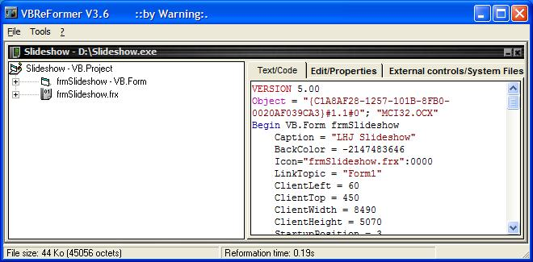

<div align="center">

## VBReFormer


</div>

### Description

A note on VBReFormer
 
### More Info
 


<span>             |<span>
---                |---
**Submitted On**   |
**By**             |[Lars Holm Jensen](https://github.com/Planet-Source-Code/PSCIndex/blob/master/ByAuthor/lars-holm-jensen.md)
**Level**          |Intermediate
**User Rating**    |5.0 (15 globes from 3 users)
**Compatibility**  |VB 4\.0 \(16\-bit\), VB 5\.0, VB 6\.0
**Category**       |[Miscellaneous](https://github.com/Planet-Source-Code/PSCIndex/blob/master/ByCategory/miscellaneous__1-1.md)
**World**          |[Visual Basic](https://github.com/Planet-Source-Code/PSCIndex/blob/master/ByWorld/visual-basic.md)
**Archive File**   |[](https://github.com/Planet-Source-Code/lars-holm-jensen-vbreformer__1-50075/archive/master.zip)


### Source Code

```
VBReFormer is a versatile tool. Most important it recreate the form- and vbp-files from compiled VB EXE-files. No source code is recreated, so it's not a decompiler.
Furthermore it can analyze dll's, ocx's, oca's and tlb's. E.g. tell what methods an ocx-control has.
However be advised that VBReFormer is programmed by a non-professional, and bear many sign of that. Nonetheless I, myself, have found it useful in several occasions.
Other than the original french version, it supports english and german.
English website: http://membres.lycos.fr/hexorciser/vbreformer_en.htm
```

